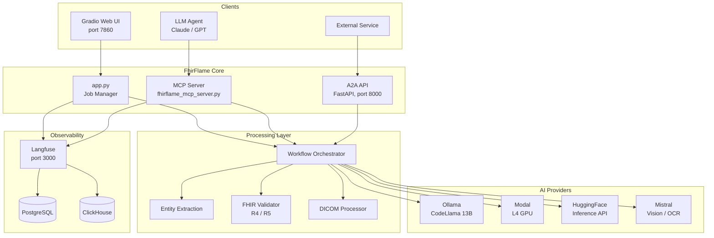
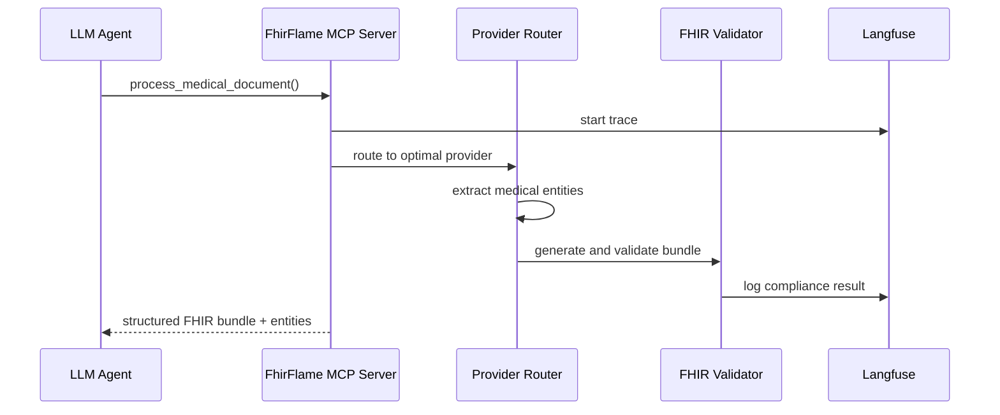

<p align="center">
  
</p>

<p align="center">
  <strong>Medical AI platform for document processing, FHIR compliance, and agent-to-agent communication.</strong>
</p>

<p align="center">
  <a href="https://www.python.org/downloads/"></a>
  <a href="LICENSE"></a>
  <a href="https://www.hl7.org/fhir/"></a>
  <a href="https://modelcontextprotocol.io/"></a>
  <a href="https://www.docker.com/"></a>
  <a href="https://huggingface.co/spaces/grasant/fhirflame"></a>
</p>

---

> **Disclaimer -- Prototype / MVP Only**
>
> FhirFlame is a technology demonstration for development, testing, and educational purposes.
> It is **not** approved for clinical use, patient data, or production healthcare environments.
> Any real-world deployment requires independent regulatory evaluation, compliance review,
> and legal assessment.

---

## Table of Contents

- [Overview](#overview)
- [Key Features](#key-features)
- [Architecture](#architecture)
- [Quick Start](#quick-start)
- [MCP Tools](#mcp-tools)
- [A2A API](#a2a-api)
- [Configuration](#configuration)
- [Project Structure](#project-structure)
- [Testing](#testing)
- [Technology Stack](#technology-stack)
- [Contributing](#contributing)
- [License](#license)

---

## Overview

FhirFlame is a dockerized medical AI platform that ingests clinical text, PDF/image
documents, and DICOM imaging metadata, then extracts structured medical entities and
produces validated FHIR R4/R5 bundles. It exposes its capabilities through a Gradio web
UI, a FastAPI agent-to-agent (A2A) REST API, and a Model Context Protocol (MCP) server
for integration with LLM-based agents such as Claude and GPT.

AI workloads are routed across multiple providers -- Ollama (local, free), Modal (GPU
cloud), HuggingFace Inference API, and Mistral (vision/OCR) -- with automatic fallback.
Observability is handled by Langfuse, backed by PostgreSQL and ClickHouse, all
orchestrated via Docker Compose.

---

## Key Features

- **MCP Server** -- two healthcare-specific tools (`process_medical_document`,
  `validate_fhir_bundle`) for seamless LLM agent integration.
- **FHIR R4/R5 Validation** -- generates and validates HL7 FHIR-compliant bundles with
  a zero-dummy-data policy.
- **Multi-Provider AI Routing** -- Ollama, Modal L4 GPU, HuggingFace, and Mistral
  Vision, with intelligent fallback and cost-aware selection.
- **DICOM Processing** -- extracts metadata from medical imaging files via pydicom.
- **Agent-to-Agent API** -- FastAPI-based REST endpoints for inter-service communication
  and EHR system integration.
- **Observability** -- Langfuse tracing and monitoring with PostgreSQL persistence and
  ClickHouse analytics.
- **Docker Compose Orchestration** -- single-command deployment of the full stack
  (Gradio UI, Ollama, A2A API, Langfuse, PostgreSQL, ClickHouse).
- **Comprehensive Test Suite** -- 29 test modules covering unit, integration, MCP, FHIR
  validation, and GPU workflows.

---

## Architecture


```mermaid
graph TB
    subgraph clients [Clients]
        Browser[Gradio Web UI<br/>port 7860]
        Agent[LLM Agent<br/>Claude / GPT]
        ExtAPI[External Service]
    end

    subgraph core [FhirFlame Core]
        App[app.py<br/>Job Manager]
        MCPServer[MCP Server<br/>fhirflame_mcp_server.py]
        A2A[A2A API<br/>FastAPI, port 8000]
    end

    subgraph processing [Processing Layer]
        Orchestrator[Workflow Orchestrator]
        EntityExtract[Entity Extraction]
        FHIRValid[FHIR Validator<br/>R4 / R5]
        DICOMProc[DICOM Processor]
    end

    subgraph providers [AI Providers]
        Ollama[Ollama<br/>CodeLlama 13B]
        Modal[Modal<br/>L4 GPU]
        HF[HuggingFace<br/>Inference API]
        Mistral[Mistral<br/>Vision / OCR]
    end

    subgraph observability [Observability]
        Langfuse[Langfuse<br/>port 3000]
        Postgres[(PostgreSQL)]
        ClickHouse[(ClickHouse)]
    end

    Browser --> App
    Agent --> MCPServer
    ExtAPI --> A2A

    App --> Orchestrator
    MCPServer --> Orchestrator
    A2A --> Orchestrator

    Orchestrator --> EntityExtract
    Orchestrator --> FHIRValid
    Orchestrator --> DICOMProc

    Orchestrator --> Ollama
    Orchestrator --> Modal
    Orchestrator --> HF
    Orchestrator --> Mistral

    App --> Langfuse
    MCPServer --> Langfuse
    Langfuse --> Postgres
    Langfuse --> ClickHouse
```

---

## Quick Start

### Prerequisites

- [Docker](https://docs.docker.com/get-docker/) and Docker Compose
- Python 3.11+ (for local development without Docker)
- 8 GB RAM minimum
- NVIDIA GPU optional (enables local Ollama acceleration)

### Option A -- Docker (recommended)

```bash
git clone https://github.com/grasant/fhirflame.git
cd fhirflame
cp .env.example .env          # edit .env to add optional API keys
docker compose -f docker-compose.local.yml up -d
```

Once running:

| Service | URL |
| --- | --- |
| Gradio UI | `http://localhost:7860` |
| A2A API | `http://localhost:8000` |
| Langfuse | `http://localhost:3000` |
| Ollama | `http://localhost:11434` |

### Option B -- Local Python

```bash
git clone https://github.com/grasant/fhirflame.git
cd fhirflame
python -m venv .venv && source .venv/bin/activate   # or .venv\Scripts\activate on Windows
pip install -r requirements.txt
cp .env.example .env
python app.py
```

The Gradio UI starts at `http://localhost:7860`.

### Hugging Face Spaces

A hosted demo is available at
[huggingface.co/spaces/grasant/fhirflame](https://huggingface.co/spaces/grasant/fhirflame).

---

## MCP Tools

FhirFlame implements the [Model Context Protocol](https://modelcontextprotocol.io/) with
two tools designed for healthcare document workflows.

### process_medical_document

Accepts clinical text, extracts medical entities (conditions, medications, vitals,
patient info), and optionally generates a FHIR bundle.

```json
{
  "tool": "process_medical_document",
  "input": {
    "document_content": "Patient presents with chest pain and shortness of breath...",
    "document_type": "clinical_note",
    "extract_entities": true,
    "generate_fhir": true
  }
}
```

### validate_fhir_bundle

Validates a FHIR bundle against R4 or R5 specifications and returns a compliance report.

```json
{
  "tool": "validate_fhir_bundle",
  "input": {
    "fhir_bundle": { "resourceType": "Bundle", "...": "..." },
    "fhir_version": "R4",
    "validation_level": "healthcare_grade"
  }
}
```

### Agent Workflow


```mermaid
sequenceDiagram
    participant Agent as LLM Agent
    participant MCP as FhirFlame MCP Server
    participant Router as Provider Router
    participant FHIR as FHIR Validator
    participant LF as Langfuse

    Agent->>MCP: process_medical_document()
    MCP->>LF: start trace
    MCP->>Router: route to optimal provider
    Router->>Router: extract medical entities
    Router->>FHIR: generate and validate bundle
    FHIR->>LF: log compliance result
    MCP-->>Agent: structured FHIR bundle + entities
```

---

## A2A API

The agent-to-agent API runs on port 8000 (FastAPI + Uvicorn) and supports both
synchronous and asynchronous document processing.

```bash
# Health check
curl http://localhost:8000/health

# Process a clinical note
curl -X POST http://localhost:8000/api/v1/process-document \
  -H "Content-Type: application/json" \
  -d '{"document_text": "Clinical note: Patient presents with chest pain"}'
```

---

## Configuration

All configuration is managed through environment variables. Copy
[`.env.example`](.env.example) to `.env` and edit as needed.

| Variable | Required | Description |
| --- | --- | --- |
| `USE_REAL_OLLAMA` | No | Enable local Ollama provider (`true`) |
| `OLLAMA_BASE_URL` | No | Ollama endpoint, default `http://localhost:11434` |
| `OLLAMA_MODEL` | No | Model name, default `codellama:13b-instruct` |
| `MISTRAL_API_KEY` | No | Mistral API key for vision/OCR |
| `HF_TOKEN` | No | HuggingFace Inference API token |
| `MODAL_TOKEN_ID` | No | Modal Labs token ID for GPU cloud |
| `MODAL_TOKEN_SECRET` | No | Modal Labs token secret |
| `LANGFUSE_SECRET_KEY` | No | Langfuse secret key for observability |
| `LANGFUSE_PUBLIC_KEY` | No | Langfuse public key |
| `LANGFUSE_HOST` | No | Langfuse endpoint, default `https://cloud.langfuse.com` |
| `ENABLE_FHIR_R4` | No | Enable FHIR R4 validation (`true`) |
| `ENABLE_FHIR_R5` | No | Enable FHIR R5 validation (`true`) |

No API keys are required for local development -- Ollama runs entirely on your machine.

---

## Project Structure

```text
fhirflame/
├── app.py                          # Application entry point and job manager
├── frontend_ui.py                  # Gradio UI definition
├── database.py                     # PostgreSQL / SQLite persistence
├── src/
│   ├── fhirflame_mcp_server.py     # MCP server and tool handlers
│   ├── mcp_a2a_api.py              # FastAPI A2A endpoints
│   ├── workflow_orchestrator.py    # End-to-end processing pipeline
│   ├── enhanced_codellama_processor.py  # Multi-provider AI routing
│   ├── codellama_processor.py      # Base LLM processor
│   ├── fhir_validator.py           # FHIR R4/R5 validation engine
│   ├── dicom_processor.py          # DICOM metadata extraction
│   ├── file_processor.py           # File upload handling
│   ├── medical_extraction_utils.py # Entity extraction utilities
│   ├── monitoring.py               # Langfuse integration
│   └── heavy_workload_demo.py      # Batch processing demo
├── cloud_modal/                    # Modal Labs cloud functions
├── modal_deployments/              # Standalone Modal app definitions
├── tests/                          # 29 test modules (pytest)
│   ├── pytest.ini                  # Pytest configuration
│   └── medical_files/              # Test fixtures
├── official_fhir_tests/            # FHIR R4/R5 JSON fixtures
├── samples/                        # Sample clinical documents
├── static/                         # Favicon and web manifest
├── docker-compose.local.yml        # Full local stack (6 services)
├── docker-compose.modal.yml        # Modal-oriented deployment
├── Dockerfile                      # Main container image
├── Dockerfile.hf-spaces            # Hugging Face Spaces image
├── requirements.txt                # Python dependencies
├── .env.example                    # Environment variable template
└── LICENSE                         # Apache 2.0
```

---

## Testing

The test suite uses pytest with asyncio support and is configured in
[`tests/pytest.ini`](tests/pytest.ini).

```bash
# Run the full suite
python -m pytest tests/ -v

# Run with coverage
python -m pytest tests/ --cov=src --cov-report=term-missing

# Run a specific marker
python -m pytest tests/ -m unit -v
```

Available markers: `unit`, `integration`, `gpu`, `mcp`.

---

## Technology Stack

### Core

- Python 3.11, FastAPI, Gradio, asyncio

### AI / ML

- Ollama (CodeLlama 13B), HuggingFace Inference API, Modal Labs (L4 GPU), Mistral (vision/OCR)
- LangChain for orchestration

### Healthcare

- FHIR R4/R5 via `fhir-resources`, DICOM via `pydicom`, HL7 standards

### Infrastructure

- Docker Compose, PostgreSQL, ClickHouse, Langfuse
- Hugging Face Spaces and Modal Labs for cloud deployment

### Test Frameworks

- pytest, pytest-asyncio, pytest-cov, pytest-mock, pytest-benchmark

---

## Contributing

Contributions are welcome. To get started:

```bash
git clone https://github.com/grasant/fhirflame.git
cd fhirflame
pip install -r requirements.txt
python -m pytest tests/ -v
```

1. Fork the repository and create a feature branch.
2. Make your changes and ensure all tests pass.
3. Submit a pull request with a clear description of the change.

---

## License

This project is licensed under the [Apache License 2.0](LICENSE).
